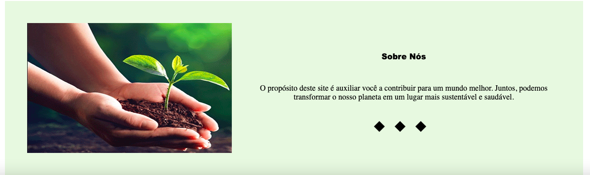
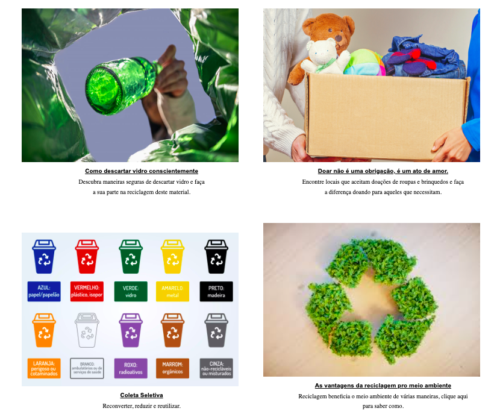
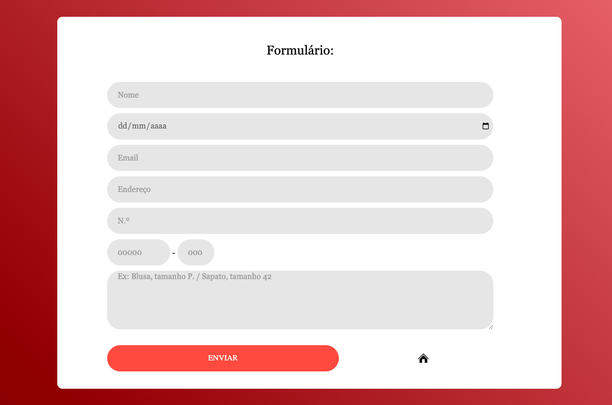
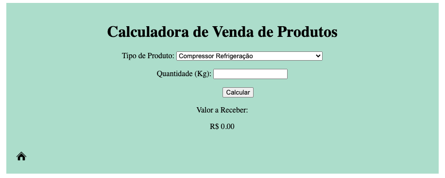
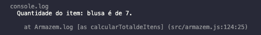

<h1 align="center"> Projeto Final - Descarte consciente </h1> 



O site possui informações importantes sobre a reciclagem e a importância da doação.

<p align="center"></p>

<p align="center"> Possuindo uma tela para cadastro de doadores: </p>

<p align="center"></p>

Possui uma Classe _'Pessoa'_ que recebe as informações preenchidas pelo doador:

```javascript
class Pessoa {
    constructor() {
        this.nameInput = document.querySelector("#nome");
        this.testeDiv = document.querySelector("#teste");
        this.enviarButton = document.querySelector("#botao");
        this.enviarButton.addEventListener("click", this.enviar.bind(this));
        this.dataDeNascimento = document.querySelector("#data");
        this.email = document.querySelector("#email");
        this.tamanho = document.querySelector("#tamanho");
        this.roupa = document.querySelector("#roupas");
        this.endereco = [document.querySelector("#rua"), document.querySelector("#cep"), document.querySelector("#cep2"), document.querySelector("#numero")];
    }
    ...
}

```

Também incluímos uma calculadora que permite estimar o retorno financeiro que a reciclagem pode proporcionar:



Possui uma classe _'CalculadoraValor'_ que recebe as informações preenchidas pelo usuário:

```javascript
class CalculadoraValor {
    constructor() {
        this.inicializarElements();
        this.inicializarEventListener();
    }

    inicializarElements() {
        this.selecionarTipoProduto = document.getElementById("product-type");
        this.entradaQuantidade = document.getElementById("quantity");
        this.ValorResultado = document.getElementById("result-value");
        this.botaoCalcular = document.getElementById("calcularButton");
        this.taxasConversao = { // por kilo
            compressor: 3.0,
            motor: 3.0,
            ferro: 20.0,
            mel: 38.0,
            misto: 35.0,
            ...
        }

    }
    ...
}
```

E uma função _`calcularValor()`_, que retorna o valor já convetido em reais, de acordo com o item e quantidade selecionado. 

```javascript
calcularValor() {
        const tipoProduto = this.selecionarTipoProduto.value;
        const quantidade = parseFloat(this.entradaQuantidade.value);
        const valorReceber = (this.taxasConversao[tipoProduto] || 0) * quantidade;
        const valorReceberConvert = valorReceber.toLocaleString('pt-br', { style: 'currency', currency: 'BRL' });
        this.ValorResultado.textContent = valorReceberConvert;
    }
```
---
---
# As Classes:

## Voluntário

Que recebe os dados dos voluntários cadastrados

```javascript
class Voluntario {
    #dataNascimento;
    #cpf;
    nome;
    email;
    cidade;
    bairro;
    automovel;

    constructor(dataNascimento, cpf, nome, email, cidade, bairro, automovel) {
        this.#dataNascimento = dataNascimento;
        this.#cpf = cpf;
        this.nome = nome;
        this.email = email;
        this.cidade = cidade;
        this.bairro = bairro;
        this.automovel = automovel;
    }
    ...
}
```

## Armazem

Onde um voluntário pode realizar o cadastro dos itens doados:

```javascript
class Armazem {
    top;
    parteInferior;
    sapatos;
    vestidos;
    brinquedos;
    outros;

    constructor() {
        this.top = [];
        this.parteInferior = [];
        this.sapatos = [];
        this.vestidos = [];
        this.brinquedos = [];
        this.outros = [];
    }
    ...
}
```

# As funções:

## AdicionarItens()

A função inclui no array o item e sua descrição fornecida pelo voluntário para manter uma base de registro.

```javascript
adicionarItem(tipo, tamanho, qtd, descricao) {
        switch (tipo) {
            case "short":
            case "calça":
            case "bermuda":
            case "saia":
            case "calção":
            case "legging":
                this.parteInferior.push({ tipo: tipo, tamanho: tamanho, quantidade: qtd, descrição: descricao });
                break;
                ...
        }
}
```

## calcularTotaldeItens(tipoDesejado)

```javascript
 calcularTotaldeItens(tipoDesejado) {
        let total = 0;


        for (let i = 0; i < this.top.length; i++) {
            const top = this.top[i];
            if (top.tipo === tipoDesejado) {
                total += top.quantidade;
                console.log(`Quantidade de ${tipoDesejado} é de ${total}.`);
            }
        }
        ...
 }
```
Essa função retorna a quantidade de itens de acordo com o tipo especificado, como exemplificado abaixo:

```javascript

doador.adicionarItem("blusa", "M", 5, "Blusa de algodão");
doador.adicionarItem("blusa", "P", 2, "Blusa de Cetim");

test('Calcular total de blusas', () => {
        const totalBlusas = doador.calcularTotaldeItens("blusa");
        expect(totalBlusas).toBe(7);
    });
```
resultado:



----
---

# Tecnologias Utilizadas

<p>

</p>

# Referências e Links

- [Diretrizes de descarte](https://vidramaq.com.br/blog/descarte-de-vidro-como-fazer-corretamente/): diretrizes de descarte são baseadas em informações fornecidas por Vidramaq

- [Pontos de coleta de vidro em SP](https://www.abcdoabc.com.br/abc/noticia/sao-paulo-amplia-pontos-coleta-vidro-impulsionar-reciclagem-208811): Endereços de ponto de coleta, fornecidos por ABC Do ABC
- [Coleta Seletiva](https://www.i9ce.com.br/coleta-seletiva/): Informações sobre os itens permitidos para reciclagem, fornecidos por I9 Consultoria
- [Quais são os benefícios da reciclagem?](https://blog.pix.com.br/beneficios-da-reciclagem/#:~:text=A%20reciclagem%20usa%20menos%20energia,g%C3%A1s%20metano%20dos%20aterros%20sanit%C3%A1rios.): Texto inspirado em Blog Pix.


